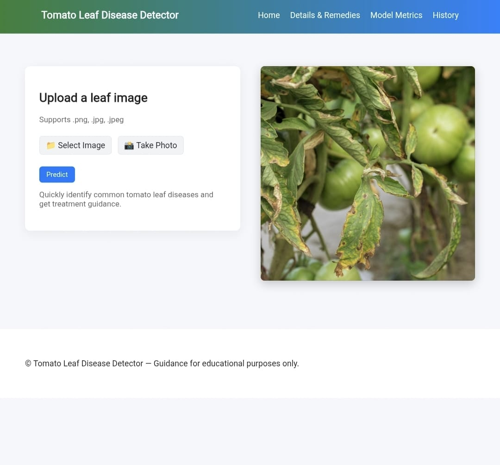
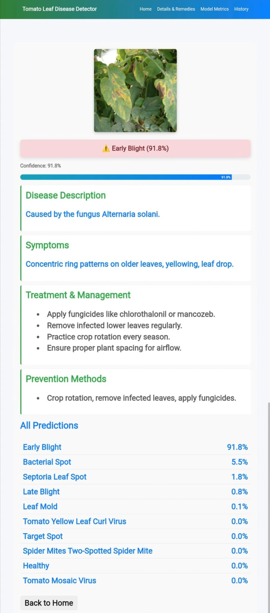
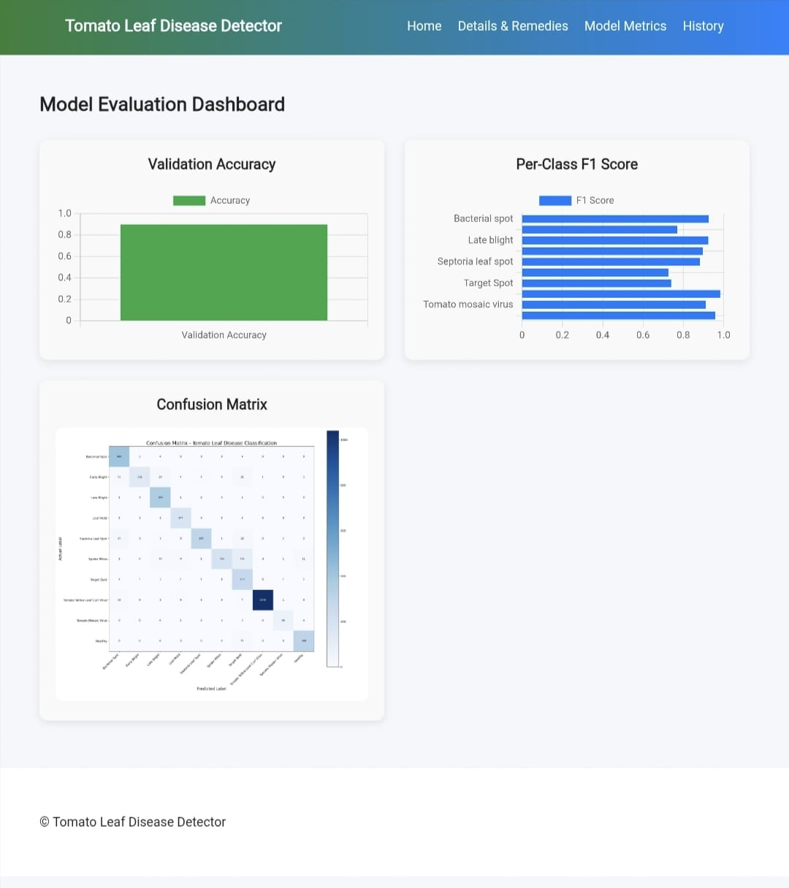
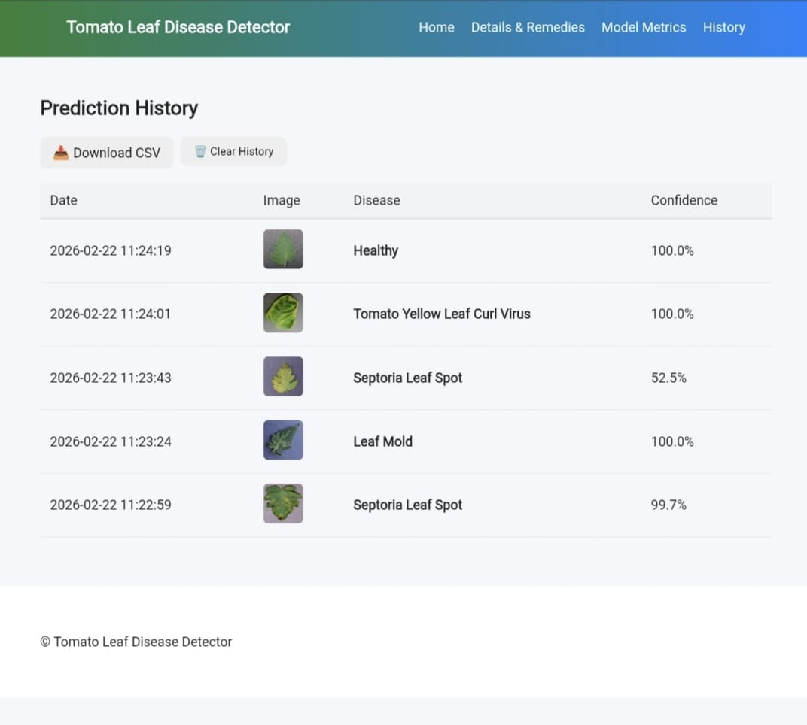

# 🍅 Tomato Leaf Disease Detection System
This project is a web-based application that detects diseases in tomato leaves using Deep Learning.  
It is built using Python, Flask, and a Convolutional Neural Network (CNN) model.

The main goal of this project is to help in early detection of plant diseases by analyzing leaf images.

---
## 📌 About the Project
In agriculture, plant diseases can reduce crop productivity.  
To address this problem, I developed a machine learning model that can classify tomato leaf diseases from images.

The system allows users to upload a tomato leaf image, and the application predicts the disease type along with confidence score. It also provides suggested remedies for the detected disease.

This project combines machine learning with web development to create a practical real-world solution.

---
## 🛠 Technologies Used
- Python  
- Flask  
- TensorFlow / Keras  
- CNN (Convolutional Neural Network)  
- HTML  
- CSS  
- JavaScript  

---
## ✨ Features

- Upload tomato leaf image  
- Predict disease type  
- Display prediction confidence  
- Show recommended remedies  
- Simple and user-friendly interface  
- Stores prediction history  

---
## 🧠 Model Information

- Model Type: CNN  
- Model File: `tomato_leaf_disease_model.h5`  
- Image preprocessing and normalization applied  
- Multi-class classification  

---
## 📂 Project Structure
tomato-leaf-disease-detection/
│
├── app.py
├── templates/
├── static/
├── tomato_leaf_disease_model.h5
├── requirements.txt
└── README.md

---
## ⚙️ How to Run the Project

1. Clone the repository:
   git clone https://github.com/saikrishna416/tomato-leaf-disease-detection.git
2. Move into the project folder:
   cd tomato-leaf-disease-detection
3. Install required packages:
   pip install -r requirements.txt
4. Run the application:
   python app.py
5. Open your browser and go to:
   http://127.0.0.1:5000
---
## 📸 Application Screenshots

### 🏠 Home Page

### 📊 Prediction Result

### 📈 Metrics Page

### 🕒 History Page

----
## 🌱 Future Improvements

- Deploy the application to cloud platform  
- Improve model accuracy  
- Add more plant disease categories  
- Make the UI fully responsive  

---
## 👨‍💻 Author

Talupuri Venkata Sai Krishna
Computer Science Engineering Student  

---

If you found this project useful, feel free to give it a ⭐
